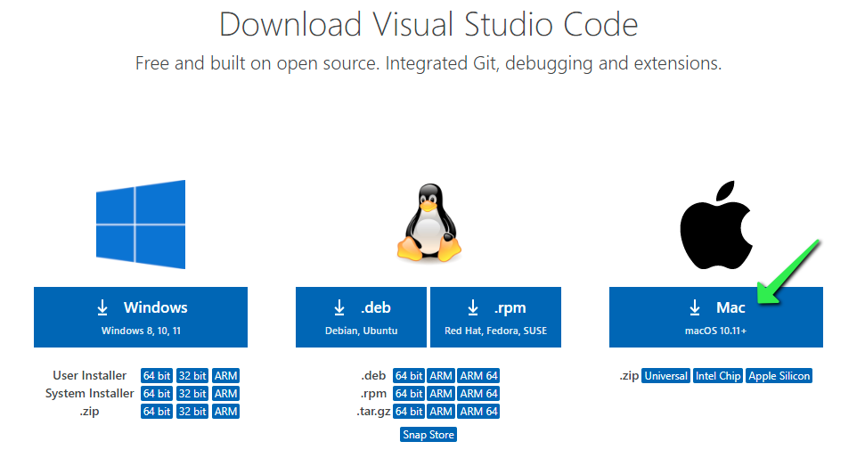
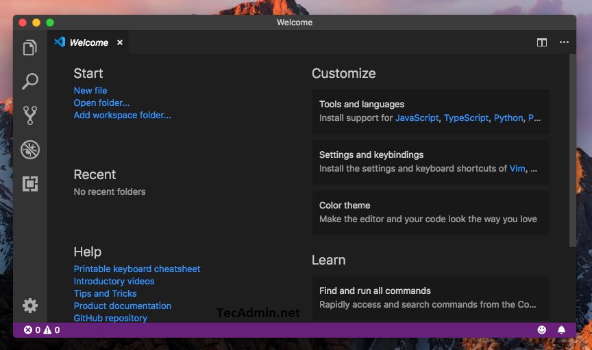
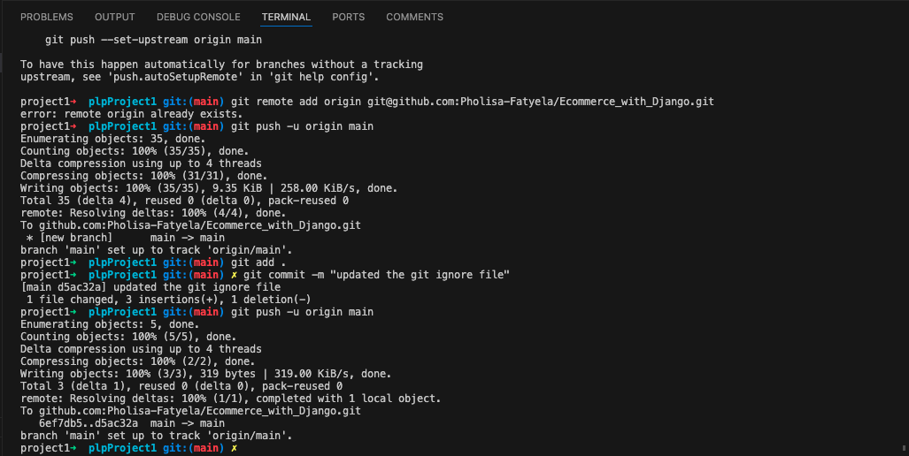
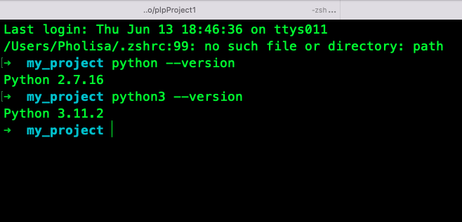
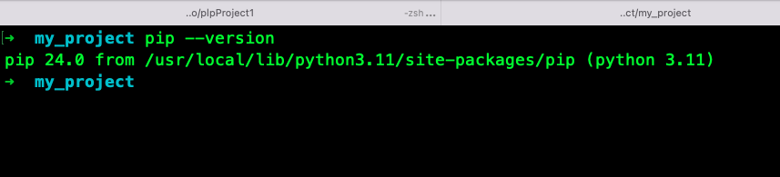
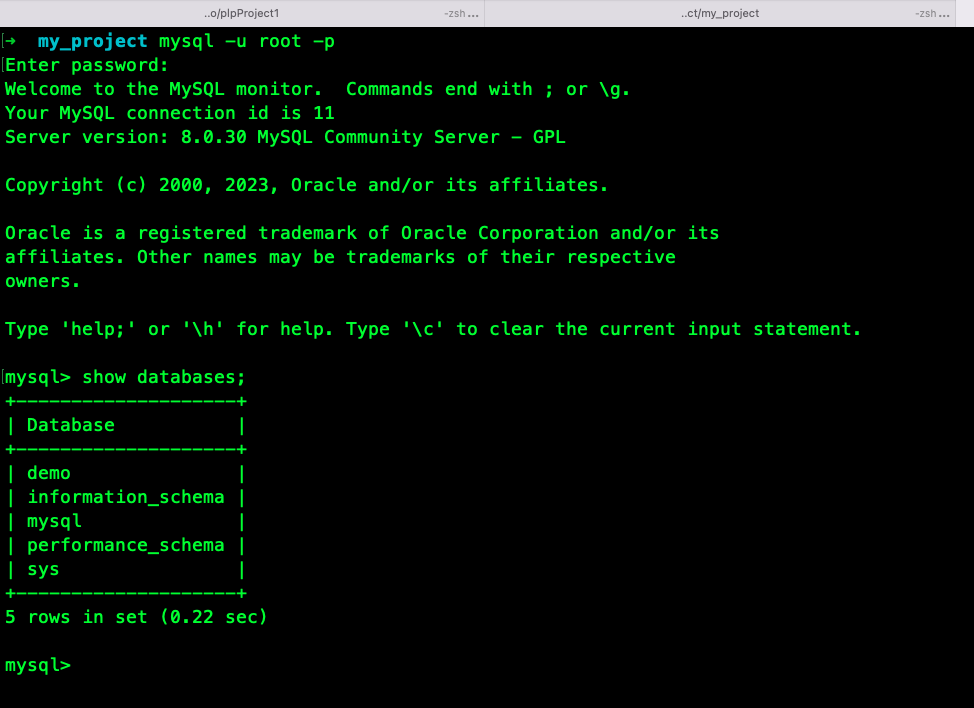
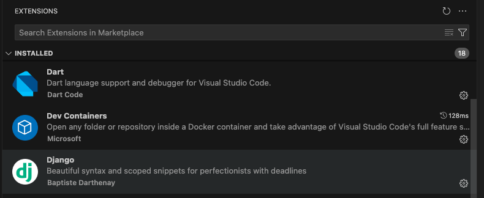
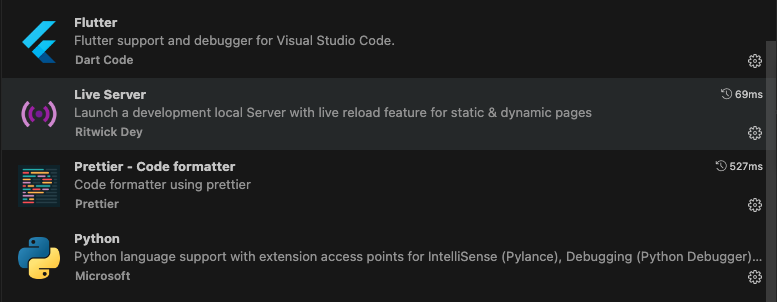
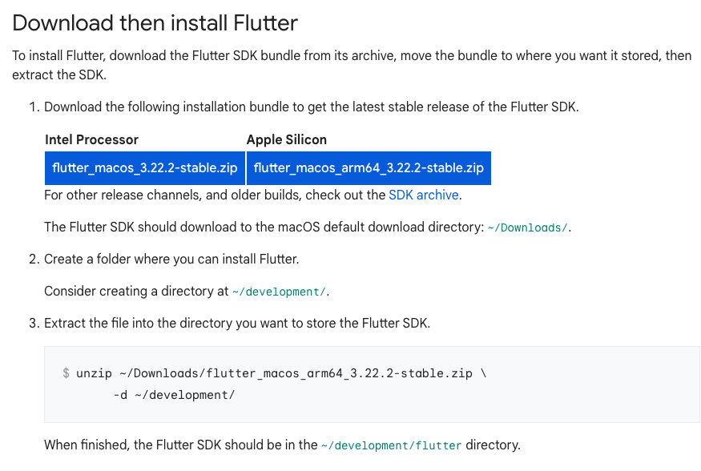

# Assignment: Setting Up Your Developer Environment

### 1. Select Your Operating System (OS)

- **Choose an OS:** For this assignment, you're installing Windows 11.
- **Download Windows 11:** Go to the [official Microsoft website](https://www.microsoft.com/software-download/windows11) to download the installer.
- **Install Windows 11:** Follow the installation instructions provided on the Microsoft website.

**Note:** If you're already using Windows 11, you can skip the installation part and move to the next step.

---

### 2. Install a Text Editor or Integrated Development Environment (IDE)

- **Choose an IDE:** Visual Studio Code (VS Code) is a popular and versatile choice.
- **Download and Install VS Code:**
  - Visit the [Visual Studio Code download page](https://code.visualstudio.com/Download).
  - Choose the appropriate version for Windows and follow the installation instructions.

  
- **Set Up VS Code:**
  - After installation, launch VS Code.
  - Customize your settings (File -> Preferences -> Settings).
  - Optionally, you can sync settings with your GitHub account for future convenience.

  


---

### 3. Set Up Version Control System

- **Install Git:**
  - Download Git from the [official Git website](https://git-scm.com/downloads).
  - Follow the installation steps for Windows.
- **Configure Git:**
  - Open the terminal (Command Prompt, PowerShell, or Git Bash) and set your user name and email:
    ```bash
    git config --global user.name "Your Name"
    git config --global user.email "your-email@example.com"
    ```
- **Create a GitHub Account:**
  - If you don't already have one, sign up at [GitHub](https://github.com).
- **Initialize a Git Repository:**
  - Create a new folder for your project.
  - Open the folder in VS Code or the terminal.
  - Initialize Git:
    ```bash
    git init
    ```
  - Create a `.gitignore` file to specify files Git should ignore (like `node_modules` or `__pycache__`).
- **Make Your First Commit:**
  - Create a simple file (e.g., `README.md`) in your project folder.
  - Add the file to Git:
    ```bash
    git add README.md
    ```
  - Commit the changes:
    ```bash
    git commit -m "Initial commit"
    ```




---

### 4. Install Necessary Programming Languages and Runtimes

- **Install Python:**
  - Download Python from the [official Python website](https://www.python.org/downloads/).
  - Choose the latest version and follow the installation instructions.
  - Ensure you check the box to add Python to your PATH during installation.
- **Verify Python Installation:**
  - Open a terminal and type:
    ```bash
    python --version
    ```
  - You should see the Python version number.



---

### 5. Install Package Managers

- **Install pip:**
  - Pip is included with Python, but ensure it's up to date by running:
    ```bash
    python -m pip install --upgrade pip
    ```
  - Verify pip installation:
    ```bash
    pip --version
    ```



---

### 6. Configure a Database (MySQL)

- **Download MySQL:**
  - Visit the [MySQL download page](https://dev.mysql.com/downloads/windows/installer/5.7.html).
  - Choose the appropriate installer for Windows.
- **Install MySQL:**
  - Follow the installation wizard instructions.
  - Set up a root password during installation and note it down securely.
- **Verify MySQL Installation:**
  - Open MySQL Workbench or a terminal and connect using the root account.
  - Run a simple query to test the connection:
    ```sql
    SHOW DATABASES;
    ```



---

### 7. Set Up Development Environments and Virtualization (Optional)

- **Consider Virtualization Tools:**
  - **Docker:** Useful for containerizing applications.
    - Download Docker from the [official Docker website](https://www.docker.com/products/docker-desktop).
    - Follow the installation instructions and set up a simple container to verify the installation.
  - **Virtual Machines:** Tools like VirtualBox or VMware can be used to create virtual machines for testing different environments.
    - Download VirtualBox from the [official VirtualBox website](https://www.virtualbox.org/).
    - Follow the installation instructions and set up a simple VM.

---

### 8. Explore Extensions and Plugins

- **For VS Code:**
  - Open the Extensions view (View -> Extensions or `Ctrl+Shift+X`).
  - Install useful extensions like:
    - **Python**: For Python development.
    - **GitLens**: Enhances Git capabilities.
    - **ESLint**: For JavaScript linting.
    - **Prettier**: Code formatter.
  - Explore and install any other extensions that suit your workflow.



---

### Reflections

Majority of my setup was done previously. I only had to upgrade and install some packages like Python & pip

- Some of the installations gave me issues like Flutter. As much as the documentation is clear. I did not read all the instruction and had downloaded the wrong zip file for my machine. This took a bit of a deep dive for me to be able to figure out what was wrong. With the willingness to start over again.
  - Official Flutter site [Flutter install](https://docs.flutter.dev/get-started/install/macos/desktop?tab=download)

  
